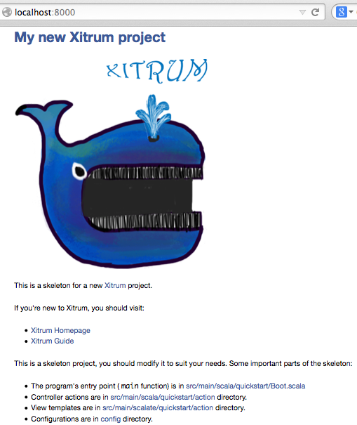

Xitrum projects require Java 8+.

To create a new `Xitrum <http://xitrum-framework.github.io/>`_ project,
download project skeleton `xitrum-new.zip <https://github.com/xitrum-framework/xitrum-new/archive/master.zip>`_,
unzip, then run:

::

  sbt/sbt run

Now you have a new empty skeleton project running at
http://localhost:8000/ and https://localhost:4430/

To generate Eclipse project:

::

  sbt/sbt eclipse
